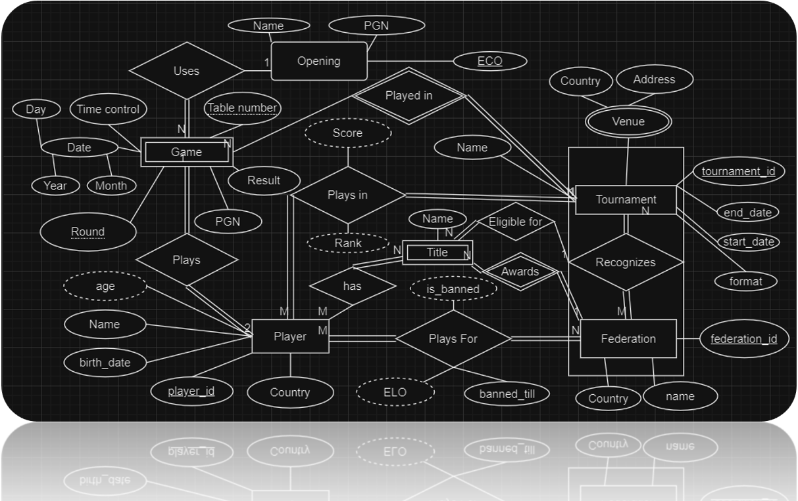

# Tournament-Management-System
Aadrito Datta & Souradeep Dutta

### Requirements
- Python
- Streamlit
- My SQL
Note: To install streamlit run
```
pip install streamlit
```

To run the project:
1. Clone the repository
2. Open terminal in the Directory and run
```
streamlit run ./Homepage.py</code>
```

### Tech Stack
- Python
- My SQL
- Streamlit

## Problem Statement
***A new chess tournament management system that is designed to address these challenges***

Current chess tournament systems stifle growth with:
- Limited data analysis hindering informed decision-making
- Lack of accessibility and scalability for large-scale events
- Hard for competitors to query large amounts of data
- Hard to maintain up-to-date information about player eligibility
- Chess software is out-of-date
- Lack of a centralized system to handle ELO updates making the system more error-prone

### Assumptions
- A player can participate in many tournaments
- Each tournament has multiple participants
- Each tournament consists of multiple games
- Each game is played between 2 players
- A player can be part of 1 or more federations
- Each federation has its own independent ELO ratings and titles
- When a tournament is recognized by a federation, the tournament affects the ELO rating of participating players with that federation
- A federation awards titles to players
- A player can have 1 more titles
- A tournament can be eligible to award a player with a title-norm if it meets certain criteria
- Each game played follows exactly 1 opening till a certain move
- Each opening has a unique ECO code
- A tournament can occur across 1 or more venues and can be recognized by multiple federations
- A game between 2 players can have 1 result which can be used to calculate the change in a player's score and rating
- The standings of the tournament can be calculated from the score
- A federation can ban a player till a certain date
- Each game has exactly one time control for the game but the time control may differ across the tournament
- A game can be standalone or part of a tournament. A standalone game cannot affect ratings of any federation as it is not part of a recognized tournament
- A tournament can be eligible to grant titles for a federation only if it is recognized by the federation. It can be eligible to grant some titles but not others
- A game occurs within 1 day and does not span multiple days
- The moves of a game can be represented using Portable Game Notation (PGN) but it is not unique, as different games can have the same moves
- A player’s federation may not be related to their country
- A player finishes a tournament with a certain score and a certain rank
- An opening may or may not have games played with that opening
- A player's rating for a federation can be calculated using the ELO rating system from the results of games in tournaments recognized by the federation
- A player can have 0, 1 or more titles from the same federation
- A player is part of at least 1 federation and a federation has at least 1 player
- A player has participated in at least 1 tournament and a tournament has at least 1 player
- A player has played at least 1 game at some point
- The ECO code uniquely identifies the opening
- A player has a name and a date of birth and citizenship to a country

### ER Model

